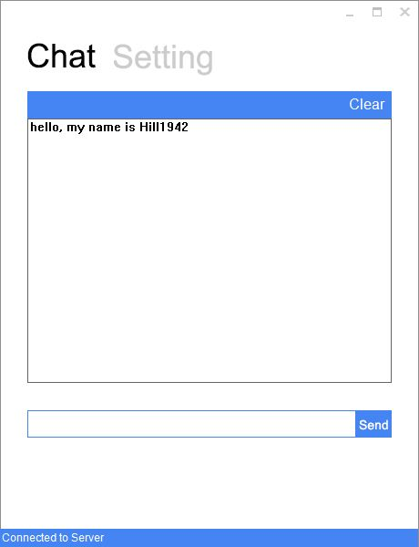
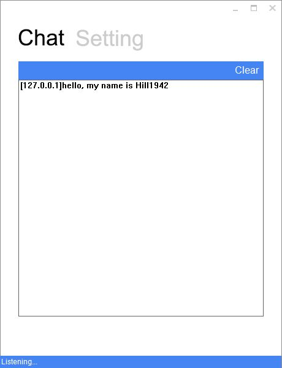

Talking
=======

This is a Win32 Socket System. In this System, a client can send message to server. And these message will be showed on window. A good feature of the system is that its GUI is Metro-Style.

### This is the client

### This is the server

